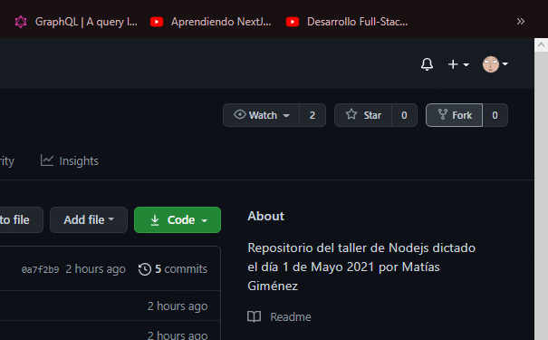
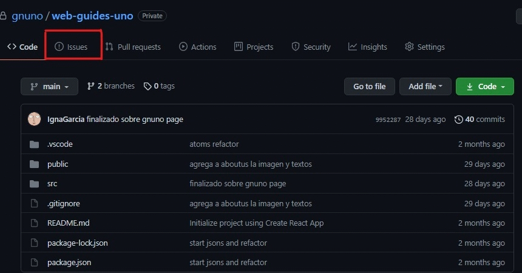
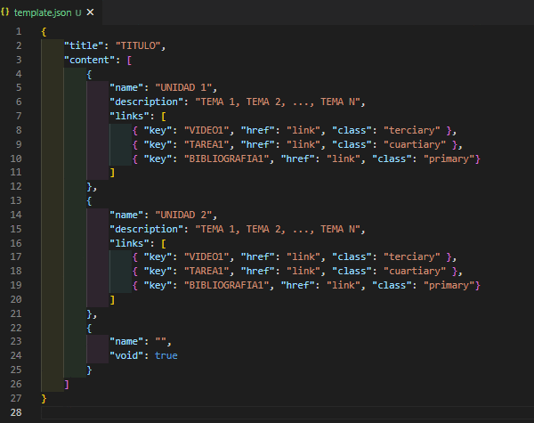

# Guides UNO
Repositorio de la web ***[guides uno]()***.
## Sobre el Proyecto
Este es un proyecto impulsado por **GNUno**, el cual consta de un conjunto de **'planes de estudio'** de diferentes tecnologías para que alguien que recién inicia tenga un camino a seguir, junto a recursos como videos, video-tutoriales y bibliografía recomendada, además del soporte que puede dar la comunidad en los grupos de telegram.
 
## SET UP
Requisitos previos
- node(npm)
 
Para ejecutar y realizar cambios ejecutar
```
npm install
npm start
```
 
## CONTRIBUIR
### Pequeña Contribución

 
Lo primero que tenes que hacer para hacer cualquier aporte es hacer un fork del ***repositorio***, luego te descargas/clonas tu fork para empezar a trabajar. La metodología es la de siempre, ir haciendo cambios y commits, para al final hacer un push a tu repo.
 
Para finalizar con el aporte lo que tenes que hacer es crear un Pull Request, dirigiéndose al repositorio en github en el que subiste los cambios y dandole al boton ***Pull Request***.

### Proponiendo Cambios

 
Otra manera de contribuir es proponiendo cambios o nuevas funcionalidades, o informando sobre fallos de la app, todo esto lo podes hacer creando un nuevo ***[Issue](https://github.com/gnuno/web-guides-uno/issues)***.
 
### Creando Guías

 
Para esto se deben seguir los mismos pasos que para una pequeña contribución, pero te ahorramos de leer el codigo y entender donde tocar. Lo primero que tenes que hacer es crear en la carpeta ***data*** tu guia .json, puedes copiar y pegar el ***template.json*** y editar desde ahí.
 
En esa nueva guia creada tenes que ir creando tus unidades, especificando los temas, y si es posible dejando links de referencia. Una vez tengas tu guia completa tenes que ir a ***dataProvider.jsx*** y hacer lo siguiente: 
- Importar el json
- Agregarlo al objeto courses 

- Crear un case en la función ***getData***
 
**NOTA**: Si tu guia sera muy larga y queres modularizar mas tenes que crear un array de templates, como se ve en ***web.js***, en ***dataProvider*** esta sera una ***proGuide***(booleanos en true), y por último en el case simplemente la prop data ira sin [], ya que data debe recibir un array, y una proGuide lo es.

## LICENCIA
[GPL-3.0 License](https://github.com/gnuno/web-guides-uno/blob/main/LICENSE)
